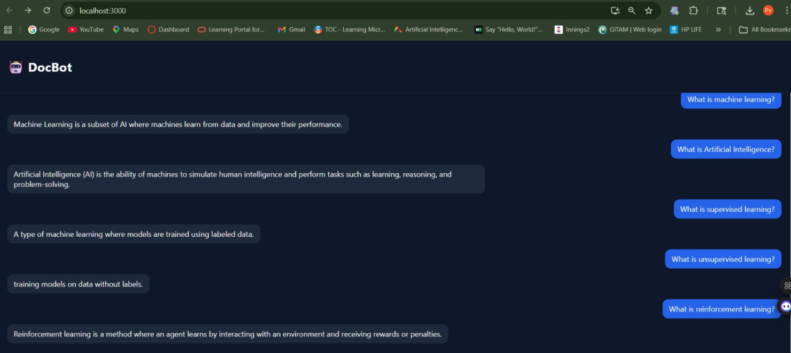

# 🤖 DocBot – AI Document Assistant

DocBot is a full-stack AI application that answers questions from a document using Retrieval-Augmented Generation (RAG).

---

## 🚀 Features

- Ask questions from a PDF
- ChatGPT-like UI
- FastAPI backend
- FAISS vector database
- Local embeddings (MiniLM)
- Local LLM (FLAN-T5)
- Works offline (no paid APIs)

---

## 🧠 How it works

1. Load PDF and split into chunks  
2. Convert chunks into embeddings  
3. Store embeddings in FAISS  
4. User asks a question  
5. Relevant chunks are retrieved  
6. FLAN-T5 generates answer  

---

## 🛠 Tech Stack

- Python (FastAPI)
- React JS
- LangChain
- FAISS
- HuggingFace Transformers

---
## 📸 Demo



## ▶️ Run Locally

### Backend

```bash
cd backend
pip install -r requirements.txt
uvicorn main:app --reload


